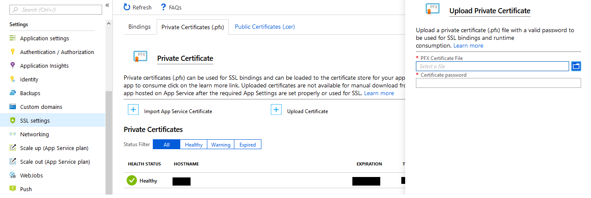
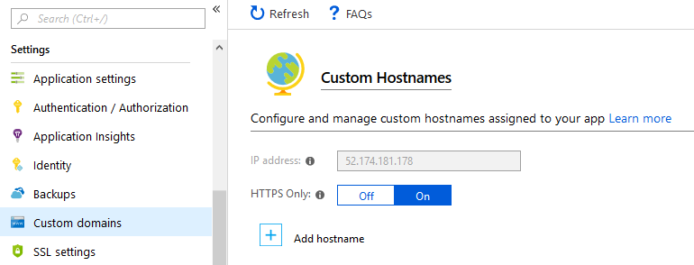

# Introduction

Tutorial covers configuration of Admin for deploy on Azure.


## Create database

If you don't have publicly accessible database you will need to create one. Follow tutorials for creating databases on Azure:

- [SQL Server](https://docs.microsoft.com/en-us/azure/sql-database/sql-database-get-started-portal)
- [PostgreSQL](https://docs.microsoft.com/en-us/azure/postgresql/quickstart-create-server-database-portal)
- [MySQL](https://docs.microsoft.com/en-us/azure/mysql/quickstart-create-mysql-server-database-using-azure-portal)

Replace connection strings in `appSettings.json` with connection string to generated database.

Then you can generate migrations:

[Follow these steps for generating of DB migrations](/README.md#ef-core--data-access)

## Deploying webbaps to Azure App Service

We will assume in the tutorial that STS and Admin were deployed to:

- https://is4-sts.azurewebsites.net - STS
- https://is4-admin.azurewebsites.net - Admin panel


### Updating URLs

Remember to replace those values with your own in `src/Skoruba.IdentityServer4.Admin/appsettings.json` before first publish -

```json
"AdminConfiguration": {
	"IdentityAdminBaseUrl": "https://is4-admin.azurewebsites.net",
	"IdentityAdminRedirectUri": "https://is4-admin.azurewebsites.net/signin-oidc",
	"IdentityServerBaseUrl": "https://is4-sts.azurewebsites.net"
}
```

Then follow instructions from [Quickstart deploy to Azure](https://docs.microsoft.com/en-us/visualstudio/deployment/quickstart-deploy-to-azure) 


### Adding certificate for signing tokens

We also need to upload pfx certificate for signing tokens. If you don't have one here are the steps to do it using openssl (remember to write down the password - we will need it later):

Windows users can download OpenSSL from [here](https://slproweb.com/products/Win32OpenSSL.html)

Or if you're using [Chocolatey](https://chocolatey.org/) you can install above package using:

```
choco install openssl.light 
```

To generate pfx certificate:

```
openssl genrsa 2048 > private.pem
openssl req -x509 -new -key private.pem -out public.pem
openssl pkcs12 -export -in public.pem -inkey private.pem -out mycert.pfx
```


Now we can upload the certificate in Azure Portal to our website:



While we're at it we can allow only https traffic to our STS and admin:



Last step before deploy - we need to update `src/Skoruba.IdentityServer4.STS.Identity/appsettings.json` and modify following lines:

```json
"CertificateConfiguration": {
    "UseTemporarySigningKeyForDevelopment": false,
    "UseSigningCertificateThumbprint": true,
    "SigningCertificateThumbprint": "<enter here thumbprint from Azure>"
}
```

Now we can (re)deploy both apps to Azure.
